## 目录
1. [推荐看的书籍](#推荐看的书籍)
2. [不推荐看的书籍](#不推荐看的书籍)

## 推荐看的书籍

#### 你不知道的 JavaScript(上卷)小黄书
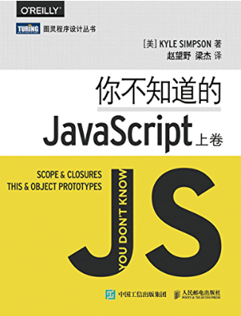

| 出版时间 |   目标受众    |  优点 | 缺点   |     评价       |  
|----------|-------------|------|------ |------ |
| 2015.4.1 | JS进阶| 优秀内容：作用域和原型。对 JS 最难的部分讲得最深如闭包、作用域、this，原型、面向对象，而且有有ES6 class 讲解 | 没有讲更基础的知识，如语法,一开始就讲到编译原理，可能吓退新手（实际上并不难懂）|    推荐会 JS 语法的人购买    |  

#### 你不知道的 JavaScript(中卷)小黄书
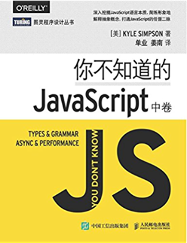

| 出版时间 |   目标受众    |  优点 | 缺点   |     评价       |  
|----------|-------------|------|------ |------ |
| 2016.8.1 | JS进阶| 回调、Promise 值得学习 | 定位尴尬:新手可能看不懂后半部分,老手不需要看前半部分|    一般推荐，有钱有时间就购买    |  

#### 高性能 JavaScript

| 出版时间 |   目标受众    |  优点 | 缺点   |     评价       |  
|----------|-------------|------|------ |------ |
| 2010.11.1 | JS进阶| 介绍了很多新手没想过的点，比如为什么 CSS 放上面 JS 放下面，比如什么会阻塞页面渲染，比如不同浏览器的性能差距很大，比如 IE 上闭包导致内存泄露，比如如何连接字符串更快，比如重绘与重排，因为面试官还挺喜欢考 | 这本书对于某些性能问题存在夸大，很多内容过时，不够深入，很多都是浅尝辄止，很多新手误读了这本书的观点，错误的观点有DOM 操作很慢、闭包导致内存泄露|    推荐购买，但不要记本书的结论，只学习本书的思路    |  

#### 编写可维护的JavaScript 乌龟书
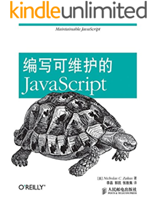

| 出版时间 |   目标受众    |  优点 | 缺点   |     评价       |  
|----------|-------------|------|------ |------ |
| 2010.11.1 | JS进阶| 介绍了很多新手没想过的点，比如为什么 CSS 放上面 JS 放下面，比如什么会阻塞页面渲染，比如不同浏览器的性能差距很大，比如 IE 上闭包导致内存泄露，比如如何连接字符串更快，比如重绘与重排，因为面试官还挺喜欢考 | 这本书对于某些性能问题存在夸大，很多内容过时，不够深入，很多都是浅尝辄止，很多新手误读了这本书的观点，错误的观点有DOM 操作很慢、闭包导致内存泄露|    推荐购买，但不要记本书的结论，只学习本书的思路    |  

#### JavaScript语言精粹蝴蝶书

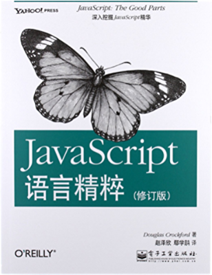

| 出版时间 |   目标受众    |  优点 | 缺点   |     评价       |  
|----------|-------------|------|------ |------ |
| 2012.9.1 | JS进阶| 让你知道 ES3 不是一门好语言，但你需要甄别哪些能用哪些不能用 | 过时且极端|    一般推荐，这本书的语法教得过于简略，如果你已经学会 JS 语法，那么你只需要看附录 A、B 即可    |  

#### 网道JavaScript 教程 阮一峰

| 出版时间 |   目标受众    |  优点 | 缺点   |     评价       |  
|----------|-------------|------|------ |------ |
| [实时更新](https://es6.ruanyifeng.com/) | 入门| 系统了解 ES 5.1,免费、细致、易懂| 没有项目实例，只讲语法和标准库|    推荐!，免费，看到就是赚到！   |  

#### ES6 标准入门 第三版

| 出版时间 |   目标受众    |  优点 | 缺点   |     评价       |  
|----------|-------------|------|------ |------ |
| [实时更新](https://github.com/ruanyf/es6tutorial/) | 入门| 系统了解 ES 6,免费、细致、易懂| 没有项目实例，只讲 ES6 语法和标准库|    推荐!，免费，看到就是赚到！   |  

#### JavaScript 忍者秘籍

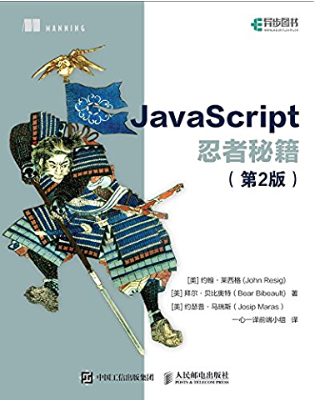

| 出版时间 |   目标受众    |  优点 | 缺点   |     评价       |  
|----------|-------------|------|------ |------ |
| 2018.1.1 | JS进阶| 主要讲函数、对象、标准库和 Promise，而且有 ES6、较深入| 没有项目实例|    推荐，新手可以购买   |  

#### Web 性能权威指南

| 出版时间 |   目标受众    |  优点 | 缺点   |     评价       |  
|----------|-------------|------|------ |------ |
| 2014.5.1 | JS进阶| 如果你对这些感兴趣可以看这本书,例如TCP、UDP、TLS、WIFI、3G、HTTP 2.0、WebSocket、WebRTC| 不够深入，篇幅很短，不如专门的书籍|    推荐，老手可以购买   |  

#### 学习 JavaScript 数据结构与算法 第2版

| 出版时间 |   目标受众    |  优点 | 缺点   |     评价       |  
|----------|-------------|------|------ |------ |
| 2017.9.14 | JS进阶|用 JS 实现常见数据结构| 由于 JS 屏蔽了内存管理，所以这本书只是从 API层面教你写出数据结构，没有深入核心但作为数据结构的入门数据还行，|    推荐，非科班生建议购买  |  

#### 算法(第4版)

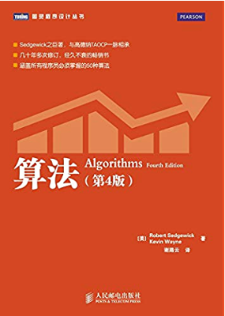

| 出版时间 |   目标受众    |  优点 | 缺点   |     评价       |  
|----------|-------------|------|------ |------ |
| 2012.10.1 | 入门|经典入门书籍，比《算法导论》友好很多| 不是用 JS 实现的，需要大段连续时间阅读|    推荐，时间多的可以购买  |  

#### 图解HTTP

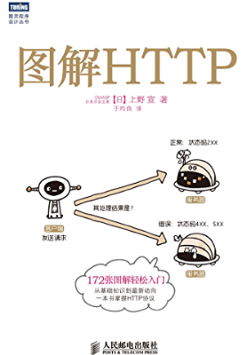

| 出版时间 |   目标受众    |  优点 | 缺点   |     评价       |  
|----------|-------------|------|------ |------ |
| 2014.5.1 | 入门|图挺多，容易看完| 第6章枯燥，建议快速扫览，没有实战，容易理解不深|    推荐，自学者建议购买  |  

#### 深入浅出React和Redux

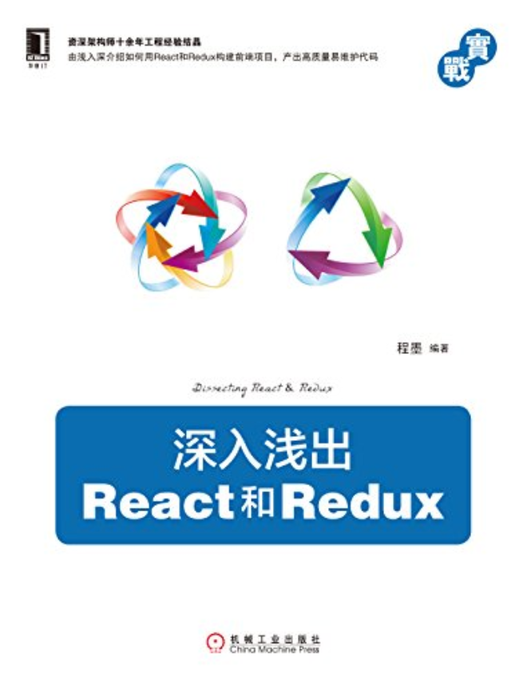

| 出版时间 |   目标受众    |  优点 | 缺点   |     评价       |  
|----------|-------------|------|------ |------ |
| 2017.4.1 | 入门|React 入门,Redux 入门,不是照本宣科,条理清晰|没有 React,Hooks（发布时间问题）|    推荐，自学者建议购买  |  

#### JavaScript 编程精解

| 出版时间 |   目标受众    |  优点 | 缺点   |     评价       |  
|----------|-------------|------|------ |------ |
| 2016.1.1 | 入门|有深有浅，结合故事,有项目实战。|内容比较多，要花多一点时间。|    推荐，自学者建议购买  |  

#### JavaScript 设计模式

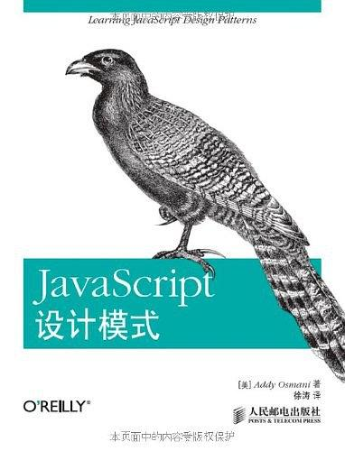

| 出版时间 |   目标受众    |  优点 | 缺点   |     评价       |  
|----------|-------------|------|------ |------ |
| 2013.6.1 | JS进阶|可以了解，发布订阅模式，观察者模式，迭代模式，装饰器模式|不推荐大家通过JS学习设计模式|    一般推荐，非常想要强烈了解设计模式，就买。另外推荐《大话设计模式》。  |  

#### CSS 揭秘

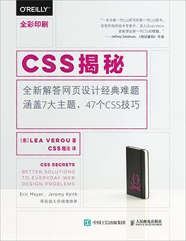

| 出版时间 |   目标受众    |  优点 | 缺点   |     评价       |  
|----------|-------------|------|------ |------ |
| 2016.4.1 | 入门|想看什么翻目录就行|CSS不推荐买书，不方便复制代码，推荐电子书或者是看MDN|    一般推荐，适合新手  |  

## 不推荐看的书籍

#### JavaScript高级程序设计前端红宝书  
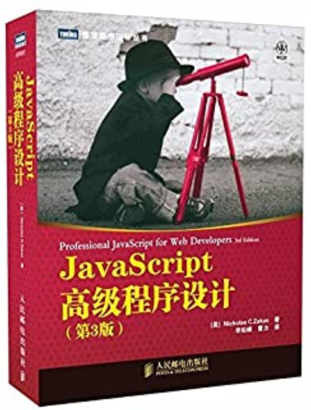

| 出版时间 |   目标受众    |  优点 | 缺点   |     评价       |  
|----------|-------------|------|------ |------ |
| 2013.4.1 |  入门 | 适合代码洁癖者，学习代码风格、代码性能指导| 最大问题是过时了，ES6、ESLint、Cli 工具已经很好地解决了大部分问题。|    一般推荐，如果有兴趣就买     |  

#### JavaScript权威指南犀牛书 
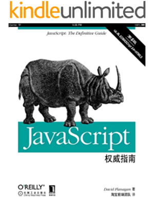

| 出版时间 |   目标受众    |  优点 | 缺点   |     评价       |  
|----------|-------------|------|------ |------ |
| 2012.4.25 | 工具书字典| 没有 | 不适合阅读|     不推荐,作为字典不如直接搜 MDN      | 

#### JavaScript DOM编程艺术

| 出版时间 |   目标受众    |  优点 | 缺点   |     评价       |  
|----------|-------------|------|------ |------ |
| 2011.4.1 | 入门| 结合实例讲解 DOM | 由于是做实例，所以如果中间卡壳了，就很难继续看后续章节，对新手不够友好,而且操作DOM不如利用Vue和React|    不推荐购买，除非想学DOM     |  

#### 重构(第2版)
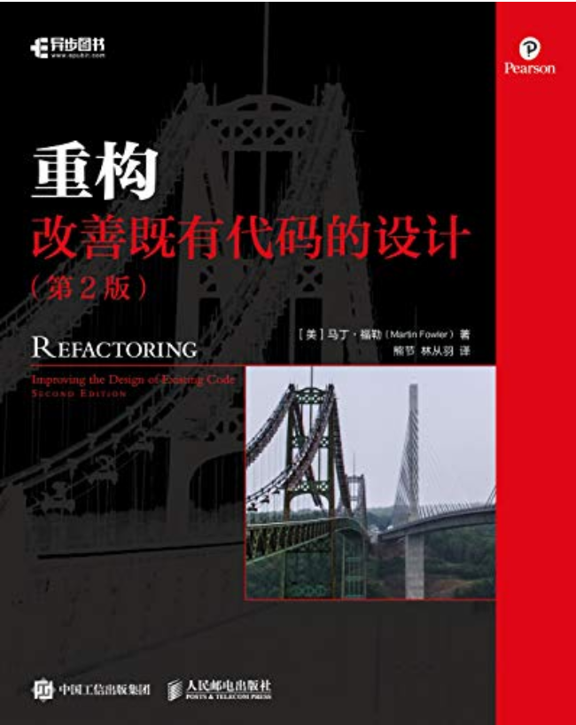

| 出版时间 |   目标受众    |  优点 | 缺点   |     评价       |  
|----------|-------------|------|------ |------ |
| 2019.4.1 | JS进阶| 重构技巧，套路挺全 | 阅读难度较大，首先你要阅读大段代码，然后思考其缺点是什么，然后重构它。大部分技巧用不到，大部分时候你只需要抽离函数和类这两个技巧即可|    不推荐购买，投入产出比较低     |  

#### Vue.js 项目实战

| 出版时间 |   目标受众    |  优点 | 缺点   |     评价       |  
|----------|-------------|------|------ |------ |
| 2019.1.1 | JS进阶| 比照本宣科强一点 | 项目教程真的不适合文字形式，遇到困难较难解决，版本低为Vue 1.x|    不推荐购买，请试读再决定是否购买     |  

#### Vue.js 前端开发 快速入门与专业应用

| 出版时间 |   目标受众    |  优点 | 缺点   |     评价       |  
|----------|-------------|------|------ |------ |
| 2017.2.1 | JS进阶| 全家桶介绍,把 API 全部列举了一遍 | 那我为什么不直接看官方档呢？Vue 1.x，版本低为Vue 1.x|    不推荐购买     |  

#### JavaScript 函数式编程

| 出版时间 |   目标受众    |  优点 | 缺点   |     评价       |  
|----------|-------------|------|------ |------ |
| 2015.8.1 | 入门| 入门的函数式编程 | 讲的内容太窄了,还是需要单独学习一门函数式编程语言。|    不推荐新手购买     |  