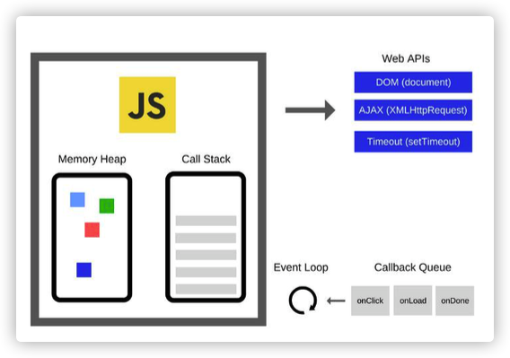

## 目录
1. [基础](#基础)
2. [进阶](#进阶)

### 基础
1. html5新特性
* 新的语义元素，比如 <header>, <footer>, <article>, and <section>。
* 新的表单控件，比如数字、日期、时间、日历和滑块。
* 强大的图像支持（借由 <canvas> 和 <svg>）
* 强大的多媒体支持（借由 <video> 和 <audio>）
* 强大的新 API，比如用本地存储取代 cookie。
* WebWorker，WebStorage, WebSocket

[更多详情](https://www.cnblogs.com/binguo666/p/10928907.html)

2. CSS3新特性
* transition
* animation
* transform
* box-shadow
* border-image
* background-clip
* word-break
* filter,rgba
* grid
* flex
* box-sizing
* media query

[更多详情](https://segmentfault.com/a/1190000010780991)

3. 函数执行上下文
(1) 语法分析阶段:分析代码是否有语法错误(SyntaxError)，如果有语法错误将会在控制台报错，并终止
   执行。
(2) 编译阶段。每进入一个不同的运行环境时都会:
   - 创建一个新的执行上下文(Execution Context)
   - 创建一个新的词法环境(Lexical Environment)，即作用域
(3) 执行阶段。Javascript 在运行过程中会产生一个调用栈，调用栈遵循 LIFO(先进后出，后进先出)原则:
   - 将步骤 (2) 中创建的执行上下文压入执行栈，并成为正在运行的执行上下文 - 执行代码
   - 在代码执行结束后，将其弹出执行栈

4. 作用域和闭包
使用词法环境Lexical Environment代替作用域描述执行上下文。词法环境有两个成员
* 环境记录Environment Record
* 外包词法环境引用Outer Lexical Environment，简称 Outer

每个词法环境的 Outer 记录了外层词法环境的引用，当在自身词法环境记录无法寻找到某个变量时，可以 根据 Outer 向外层寻找。在最外层的全局词法环境中，Outer 为 null

当代码在一个环境中执行时，会通过 Outer 创建变量对象的一个作用域链，来保证对执行环境有权访问的 变量和函数的有序访问。每个 JavaScript 执行环境都有一个和它关联在一起的作用域链，这个作用域链是 一个对象列表或对象链。在函数执行过程中，变量的解析是沿着作用域链一级一级搜索的过程:
- 从第一个对象开始，逐级向后回溯，直到找到同名变量为止

- 找到后不再继续遍历，找不到就报错

- 当函数执行结束之后，执行期上下文将被销毁(作用域链和激活对象均被销毁)

闭包
组成： 函数，以及创建该函数的环境
本质： 函数内部可以读取函数外部的变量
用途：
- 用于从外部读取其他函数内部变量的函数
- 可以使用闭包来模拟私有方法
- 让这些变量的值始终保持在内存中(涉及垃圾回收机制，可能导致内存泄露问题

5. 执行栈
函数执行过程会产生一个调用栈，调用栈可理解为一个存储函数调用的栈结构，遵循先进后出的原则

- 每调用一个函数，该函数会被添加进调用栈，并开始执行

- 如果正在调用栈中执行的A函数还调用了B函数，那么B函数也将会被添加进调用栈 - 一旦B函数被调用，便会立即执行

- 当前函数执行完毕后，解释器将其清出调用栈，继续执行当前执行环境下的剩余的代码

6. 事件循环

如图，主线程运行的时候，会产生堆(heap)和栈(stack)，其中堆为内存、栈为函数调用栈。我们能看 到，Event Loop 负责执行代码、收集和处理事件以及执行队列中的子任务，具体包括:
- Javascript有一个主线程和执行栈，所有的任务都会被放到调用栈等待主线程执行

- 同步任务会被放在调用栈中，按照顺序等待主线程依次执行

- 主线程之外存在一个任务队列，所有任务在主线程中以执行栈的方式运行

- 同步任务都在主线程上执行，栈中代码在执行的时候会调用WebAPI，此时会产生一些异步任务

- 异步任务会在有了结果(比如被监听的事件发生时)后，将注册的回调函数放入任务队列中

- 执行栈中任务执行完毕后，此时主线程处于空闲状态，会从任务队列中获取任务进行处理 
上述过程会不断重复，这就是 JavaScript 的运行机制，称为事件循环机制(Event Loop)

7. 宏任务和微任务
事件循环中的异步任务队列有两种:宏任务(MacroTask)和微任务(MicroTask)队列:
- 宏任务:包括script全部代码、setTimeout、setInterval、setImmediate(Node.js)、 requestAnimationFrame(浏览器)、I/O 操作、UI 渲染(浏览器)
- 微任务:包括process.nextTick(Node.js)、Promise、MutationObserver 

在浏览器中，异步任务队列的执行过程如下:
(1) 宏任务队列一次只从队列中取一个任务执行，执行完后就去执行微任务队列中的任务。
(2) 微任务队列中所有的任务都会被依次取出来执行，直到微任务队列为空。
(3) 在执行完所有的微任务之后，执行下一个宏任务之前，浏览器会执行 UI 渲染操作、更新界面。
我们能看到，在浏览器中每个宏任务执行完成后，会执行微任务队列中的任务。而在 Node.js 中，事件循 环分为 6 个阶段，微任务会在事件循环的各个阶段之间执行。也就是说，每当一个阶段执行完毕，就会去 执行微任务队列的任务。

### 进阶
1. 小程序为什么比H5性能要好
作为一个开放的平台，小程序在提供微信加持、体验加持的能力给开发者使用的同时，也替用户和开发者 做了很多安全性上的保障。在此基础上，小程序提出了双线程设计。

小程序的渲染层和逻辑层分别由两个线程管理:渲染层的界面使用了 WebView 进行渲染，逻辑层采用 JsCore 线程运行 Javascript 脚本。这样的设计带来两个好处:

(1) 可以阻止开发者使用一些浏览器提供的，诸如跳转页面、操作 DOM、动态执行脚本的开放性接口，来 保证小程序的安全性。

(2) 网页开发渲染线程和脚本线程是互斥的，小程序中二者分别运行在不同的线程中，因此逻辑层的代码 执行不会阻塞住渲染层的渲染逻辑，页面会更加流畅。
但是这样的设计也带来其他的问题，比如频繁交互的场景会导致线程通信过多、DOM/BOM 对象和 API 都无法在小程序中使用等。针对这些问题，小程序提供了原生组件+同屏渲染，以及 Kbone 适配库来降低 开发者的成本和门槛

其实，小程序的设计远不止于此。如果你继续深挖，可以看到里面还有虚拟 DOM 的设计、Shadow DOM 模型、自定义组件的渲染过程等等，同时还有小程序在载入、启动、更新版本等各种流程中的一些机制。

2. 怎么封装公共组件
我们拆出来的模块并不一定完全跟产品设计的一致，会根据不同的粒度、 视觉和易抽象程度来进行划分

(1)组件的划分
* 通过代码复用
* 通过视觉和交互划分

(2)组件封装
* 组件维护自身的数据和状态
* 组件维护自身的事件
* 通过初始化事件，来初始化组件状态，激活组件
* 对外提供配置项，来控制显示以及具体功能
* 通过对外提供查询接口，可获取组件状态

3. 输入url到响应的过程

4. vue-route原理

5. http协议

6. webpack
   Webpack 构建代码的过程大概如下:
   (1) Compiler 模块是 webpack 的支柱引擎，它通过 CLI 或 Node API 传递的所有选项，创建出一个 Compilation
   实例。
   (2) Compilation 实例能够访问所有的模块和它们的依赖(大部分是循环依赖)，它会对应用程序的依赖图中 所有模块进行字面上的编译。
   (3) 在编译阶段，模块会被加载(loaded)、封存(sealed)、优化(optimized)、分块(chunked)、哈希(hashed)和重
   新创建(restored)。
   (4) 最终 Webpack 整合各个依赖项，将所有这些模块打包为一个或多个 chunk/bundle 文件。
   Webpack 递归地构建一个依赖图 ，这个依赖图包含着应用程序所需的每个模块。在使用 Webpack 时，我 们需要理解 4 个核心概念: 入口(entry)、输出(output)、Loader、插件(plugins)。

(1) 入口(entry)。
入口(entry)将您应用程序的入口起点认为是根上下文或 app 第一个启动文件。例如在 Vue 中是 new Vue() 位置所在的文件，在 Angular 中是启动.bootstrap()的文件，
在 React 中则是 ReactDOM.render() 或者是 React.render()的启动文件。

(2) 输出(output)。
输出(output)属性描述了如何处理归拢在一起的代码(bundled code)，在哪里打包应用程序。简单来说，
就是最终打包好的代码放哪。一般需要以下两点配置:
- filename: 编译文件的文件名(main.js/bundle.js/index.js 等)

- path:对应一个绝对路径，此路径是你希望一次性打包的目录

(3) Loader。
Webpack 把每个文件(.css, .html, .scss, .jpg 等) 都作为模块处理。如果你看过生成的 bundle.js 代码 就会发现，Webpack 将所有的模块打包一起，每个模块添加标记 id，通过这样一个 id 去获取所需模块的代 码。但实际上 Webpack 只理解 JavaScript，因此 Loader 的作用就是把不同的模块和文件转换为 JavaScript 模块。
Loader 支持链式传递。能够对资源使用流水线()pipeline)。Loader 链式地按照先后顺序进行编译，从后 往前，最终需要返回 JavaScript。不同的应用场景需要不同的 Loader，常见的包括:

* babel-loader:babel-loader将ES6/ES7语法编译生成ES5(有些特性还是需要babel-polyfill支持) - 
* CSS相关Loader
  * css-loader: 处理 CSS 文件中的 url()
  * style-loader: 将 CSS 插入到页面的<style>标签
  * less-loader: Less 转换为 CSS
  * postcss-loader(autoprefixer-loader): 自动添加兼容前缀(-webkit-、-moz-等)
其他Loader
  * url-loader/file-loader: 修改文件名，放在输出目录下，并返其对应的 url
  * html-loader/raw-loader: 把 HTML 文件输出成字符串

(4) 插件(plugins)。
Loader 仅在每个文件的基础上执行转换，插件目的在于解决 Loader 无法实现的其他事。Webpack 插件由以 下组成:
- 一个JavaScript命名函数

- 在插件函数的prototype上定义一个apply方法 - 指定一个绑定到Webpcak自身的事件钩子

- 处理Webpack内部实例的特定数据

- 功能完成后调用Webpack提供的回调

Webpack 插件是一个具有 apply 属性的 JavaScript 对象。apply 属性会被 webpack compiler 调用，并且 compiler 对象可在整个编译生命周期访问。
一般来说，不同的框架有不同的异步加载解决方案，同时可以结合打包工具(Webpack 等)进行分块打包。 我们可以把首屏相关的东西打包到 bundle，其他模块分块打包到 chunk，来在需要的时候再进行加载。

Tree-shaking
当我们在引入一些开源代码或是公共库的时候，大多数时候我们都只是使用其中里面的一小部分代码。 Tree-shaking 通常指按需加载，即没有被引用的模块不会被打包进来，可有效地降低我们的包大小，减少 应用的加载时间，呈现给用户更佳的体验。

7. 性能优化
缓存: 尽可能地利用缓存来减少资源请求时间，包括请求缓存(HTTP 缓存/CDN 缓存/后台服务 缓存)、数据缓存(Storage/indexDB)、Service Worker/PWA 等方式
* 资源优化: 降低资源包大小，包括压缩(代码/图片)、按需引入、异步加载、tree-shaking、差异 化服务(比如读写分离)、代码复用(组件化、公共包)、图片优化(瓦片化、按需加载大小)等 方式
* 渲染优化: 提升页面渲染性能/用户感知体验，包括减少 DOM 数量、减少或合并 DOM 操作、FPS60、 离屏渲染、使用骨架屏、使用 GPU 合成、使用过渡动画等
* 内存优化: 降低内存占用，包括避免内存泄露、数据享元等方式
* 计算/运行提速: 包括使用 Web Worker、Webassembly 等技术提升大数据的计算速度
* 数据查询: 通过使用索引等方式来提升数据的查询速度

而对于一个项目来说，我们通常会从以下角度来进行性能优化:
(1) 首屏性能提速，涉及技术方案可能包括按需加载/懒加载/预加载、秒看、SSR 直出、客户端容器化、客户端离线化等。
(2) 网络请求优化，涉及技术方案可能包括 CDN 优化、缓存优化、使用 HTTP/2、资源压缩(Gzip)、请求优化(合并请求、域名拆分、减少 DNS 查询时间)等。

8. websocket
初次接触 WebSocket 的人，都会问同样的问题：我们已经有了 HTTP 协议，为什么还需要另一个协议？它能带来什么好处？

答案很简单，因为 HTTP 协议有一个缺陷：通信只能由客户端发起。

举例来说，我们想了解今天的天气，只能是客户端向服务器发出请求，服务器返回查询结果。HTTP 协议做不到服务器主动向客户端推送信息。

这种单向请求的特点，注定了如果服务器有连续的状态变化，客户端要获知就非常麻烦。我们只能使用"轮询"：每隔一段时候，就发出一个询问，了解服务器有没有新的信息。最典型的场景就是聊天室。

轮询的效率低，非常浪费资源（因为必须不停连接，或者 HTTP 连接始终打开）。因此，工程师们一直在思考，有没有更好的方法。WebSocket 就是这样发明的。

它的最大特点就是，服务器可以主动向客户端推送信息，客户端也可以主动向服务器发送信息，是真正的双向平等对话，属于服务器推送技术的一种。

其他特点包括：

（1）建立在 TCP 协议之上，服务器端的实现比较容易。

（2）与 HTTP 协议有着良好的兼容性。默认端口也是80和443，并且握手阶段采用 HTTP 协议，因此握手时不容易屏蔽，能通过各种 HTTP 代理服务器。

（3）数据格式比较轻量，性能开销小，通信高效。

（4）可以发送文本，也可以发送二进制数据。

（5）没有同源限制，客户端可以与任意服务器通信。

（6）协议标识符是ws（如果加密，则为wss），服务器网址就是 URL。

9. cookie and session的关系
