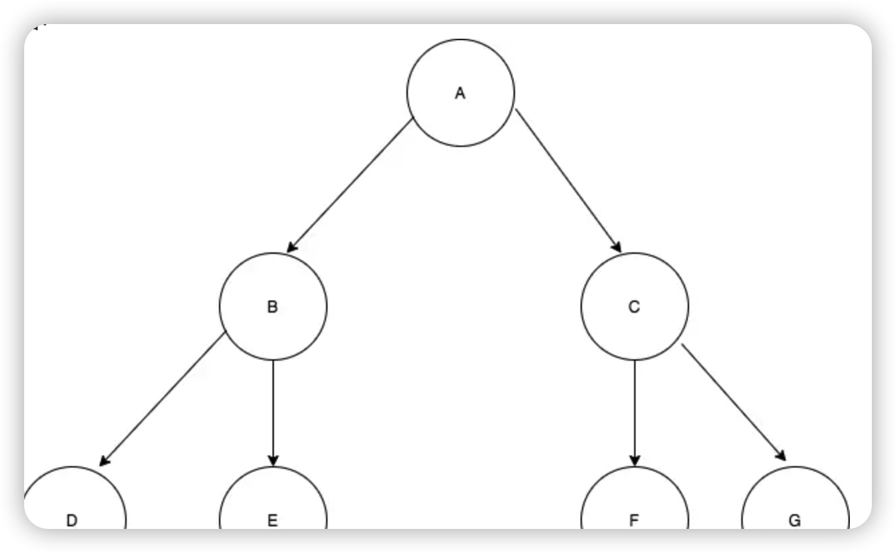

### Stack
栈是一种后进先出(LIFO，Last In First Out)的数据结构。只使用`pop`和`push`完成增删

* 只允许从尾部添加元素
* 只允许从尾部取出元素

```
// 初始状态，栈空
const stack = []

// 入栈过程
stack.push('东北大板')
stack.push('可爱多')
stack.push('巧乐兹')
stack.push('冰工厂')
stack.push('光明奶砖’)

// 出栈过程
while(stack.length) {
  // 访问元素
  const end = stack[stack.length - 1]
  console.log('现在取出的元素为', end)
  // 元素出栈
  stack.pop()
}
```

### Queue
队列是一种先进先出（FIFO，First In First Out）的数据结构。它比较像咱们去肯德基排队点餐。先点餐的人先出餐，后点餐的人后出餐。

* 只允许从尾部添加元素
* 只允许从头部移除元素

```
const queue = []
queue.push('1号客人的麦辣鸡翅')
queue.push('2号客人的薯条')
queue.push('3号客人的汉堡')

while(queue.length) {
  // 访问元素
  const start = queue[0]
  console.log('现在取出的元素为', start)
  // 元素出队列
  stack.shift()
}
```

### linked-list
链表和数组相似，它们都是有序的列表、都是线性结构（有且仅有一个前驱、有且仅有一个后继）。不同点在于，链表中，数据单位的名称叫做“结点”，而结点和结点的分布，在内存中可以是离散的。

正是由于数组中的元素是连续的，每个元素的内存地址可以根据其索引距离数组头部的距离来计算出来。因此对数组来说，每一个元素都可以通过数组的索引下标直接定位。

但是对链表来说，元素和元素之间似乎毫无内存上的瓜葛可言。就比如说咱们图上这种情况，1、2、3、4、5各据山头，站在元素1的坑位里，我们对元素2、3、4、5的内存地址一无所知，连遍历都没法遍历，这可咋整？

没有关联，就创造关联！

在链表中，每一个结点的结构都包括了两部分的内容：数据域和指针域。JS 中的链表，是以嵌套的对象的形式来实现的：

```
{
    // 数据域
    val: 1,
    // 指针域，指向下一个结点
    next: {
        val:2,
        next: ...
    }
}   
```

链表结点的创建
```
function ListNode(val) {
  this.val = val
  this.next = null
}
```

链表节点的添加
在两个节点之前添加一个节点，需要将前一个的指针指向新节点，新节点的指针指向原来第二个节点
```
const node3 = new ListNode(3)
// 新节点的指针指向原来的指向
node3.next = node1.next
// 前一个节点的指针指向新节点
node1.next = node3
```

链表节点的删除
直接让被删除节点的前驱结点的 next 指针跳过它、指向被删除节点的后继节点即可。
```
node1.next = node3.next
```
在涉及链表删除操作的题目中，重点不是定位目标结点，而是定位目标结点的前驱结点。做题时，完全可以只使用一个指针（引用），这个指针用来定位目标结点的前驱结点。
```
// 利用 node1 可以定位到 node3
const target = node1.next  
node1.next = target.next
```

链表和数组的辨析
我们假设数组的长度是 n，那么因增加/删除操作导致需要移动的元素数量，就会随着数组长度 n 的增大而增大，呈一个线性关系。所以说数组增加/删除操作对应的复杂度就是 O(n)。

如果我们在一个数组中只定义了一种类型的元素`const arr = [1,2,3,4]`。它是一个纯数字数组，那么对应的确实是连续内存。

如果我们定义了不同类型的元素`const arr = ['haha', 1, {a:1}]`。它对应的就是一段非连续的内存。此时，JS 数组不再具有数组的特征，其底层使用哈希映射分配内存空间，是由对象链表来实现的。

结论：链表的插入/删除效率较高，而访问效率较低；数组的访问效率较高，而插入效率较低。这个特性需要大家牢记，可能会作为数据结构选型的依据来单独考察

### Tree
* 树的层次计算规则：根结点所在的那一层记为第一层，其子结点所在的就是第二层，以此类推。
* 结点和树的“高度”计算规则：叶子结点高度记为1，每向上一层高度就加1，逐层向上累加至目标结点时，所得到的的值就是目标结点的高度。树中结点的最大高度，称为“树的高度”。
* “度”的概念：一个结点开叉出去多少个子树，被记为结点的“度”。比如我们上图中，根结点的“度”就是3。
* “叶子结点”：叶子结点就是度为0的结点。在上图中，最后一层的结点的度全部为0，所以这一层的结点都是叶子结点。

### Binary Tree
二叉树是指满足以下要求的树：



* 它可以没有根结点，作为一棵空树存在
* 如果它不是空树，那么必须由根结点、左子树和右子树组成，且左右子树都是二叉树。如下图
* 注意，二叉树不能被简单定义为每个结点的度都是2的树。普通的树并不会区分左子树和右子树，但在二叉树中，左右子树的位置是严格约定、不能交换的。对应到图上来看，也就意味着 B 和 C、D 和 E、F 和 G 是不能互换的。

在 JS 中，二叉树使用对象来定义。它的结构分为三块：

* 数据域
* 左侧子结点（左子树根结点）的引用
* 右侧子结点（右子树根结点）的引用

定义二叉树构造函数时，我们需要把左侧子结点和右侧子结点都预置为空：
```
// 二叉树结点的构造函数
function TreeNode(val) {
    this.val = val;
    this.left = this.right = null;
}
```
当你需要新建一个二叉树结点时，直接调用构造函数、传入数据域的值就行了：
```
const node  = new TreeNode(1)
```

