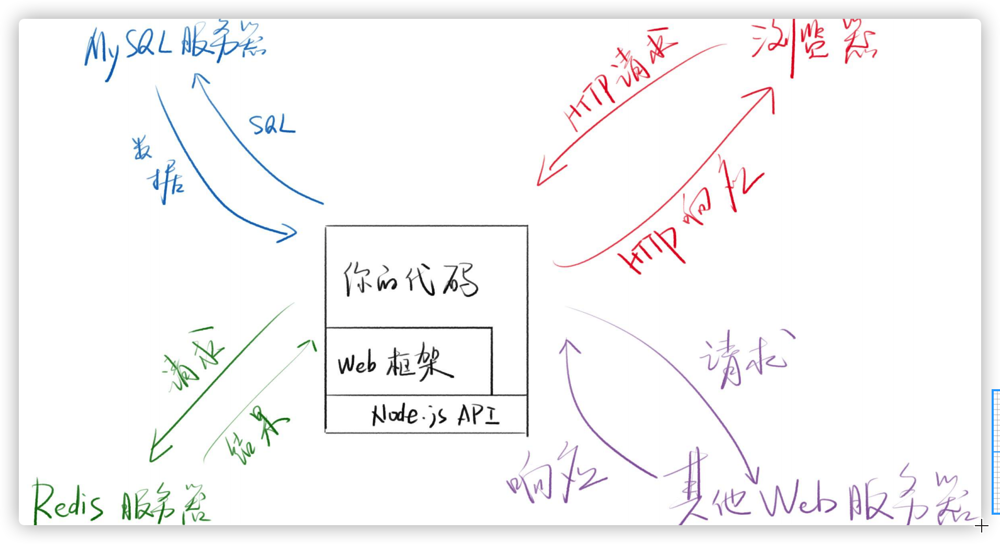
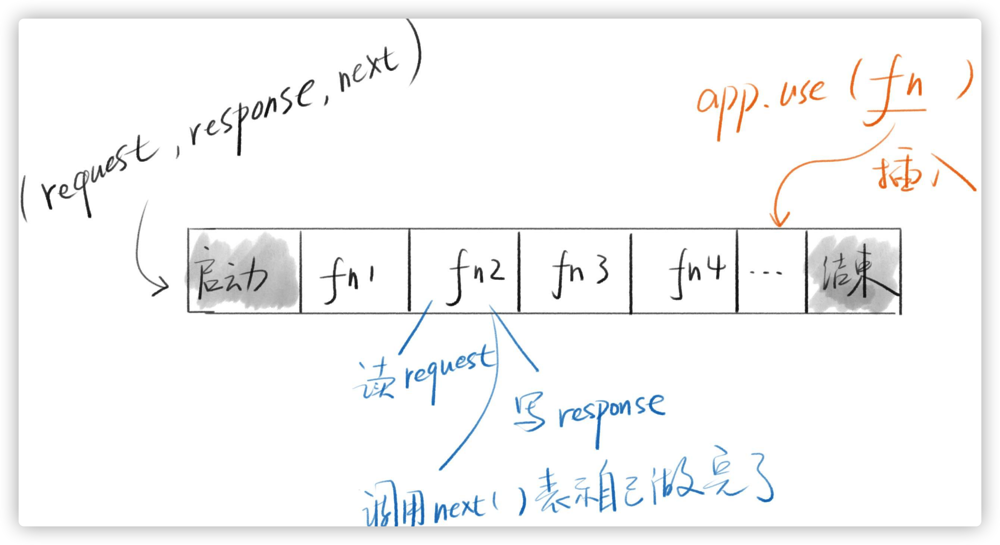

1. [web框架]](#web框架)
2. [express](#express)
3. [中间件](#中间件)
4. [错误处理](#错误处理)
x. [更多信息](#更多信息)

### web框架
功能
* 更方便处理HTTP请求和响应
* 更方便链接数据库，Redis
* 更方便的路由
* 其他： HTML模板
理念
* Web框架的主流思想都是MVC
* Model处理数据相关的逻辑
* View处理视图相关的逻辑，前后分离之后，View不重要
* Controller负责其他逻辑



### express



### 中间件
中间件指函数，被插入到启动和结束中间这个过程

#### 优点
* 模型使每个功能都能通过一个函数实现
* 通过app.use将这个函数整合起来
* 如果把函数放到文件或者npm里，就实现了模块化

#### 路由
```
app.use((req, res, next) => {
  if (req.path === '/xxx' && req.method === 'get') {
    res.write('home');
  }
  next();
});
```
### 错误处理
next(error)
* 会直接传入errorHandler， 不执行后面的中间件
自定义errorHandler
* app.use((err, req, res, next)=> {})
* 可以定义多个这样的中间件
next('route')


### 更多信息
> [Error Handler](https://expressjs.com/en/guide/error-handling.html#the-default-error-handler)

> [next('route')](https://github.com/expressjs/express/blob/4.x/lib/router/route.js#L114)