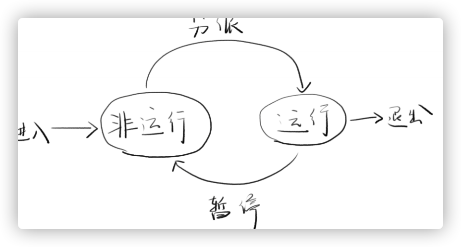
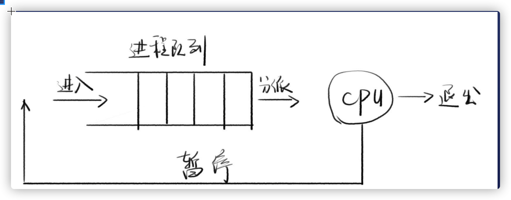
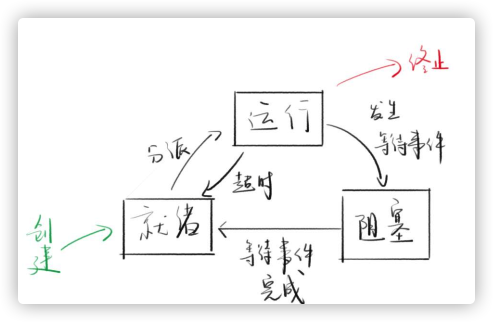

1. [Process]](#Process)
2. [CPU](#CPU)
3. [进程的两个状态](#进程的两个状态)
4. [阻塞](#阻塞)
5. [进程的三个状态](#进程的三个状态)
6. [Thread](#Thread)
7. [childProcess](#childProcess)
8. [使用流](#使用流)
9. [历史](#历史)
x. [更多信息](#更多信息)

### Procss
场景
* `notepad.exe`是一个程序，不是进程
* 双击`notepad.exe`，操作系统会开启一个进程
定义
* 进程是程序的执行实例
* 程序在CPU上执行时的活动叫做进程
* 实际上并没有明确的定义，只有一些规则
特点
* 一个进程可以创建另外一个进程（父进程与子进程）
* 通过任务管理器可以看到进程

### CPU
特点
* 一个单核CPU,在一个时刻，只能做一个事情
* 如果让用户同时看电影，写代码呢
* 原因是在不同进程中快速切换
多程序并发执行
* 指多个程序在宏观上并行，微观上串行
* 每个进程会出现，执行-暂停-执行的规律
* 多个进程之前会出现抢资源的现象

### 进程的两个状态




### 阻塞
等待执行的进程中
* 都是非运行状态
* A:一些在等待CP资源
* B:一些在等待I/O完成，例如文件读取
* 如果这个时候把CPU分配给B进程，B还是在等I/O
* 我们称B为阻塞进程
* 分派程序只会把CPU分配给非阻塞进程

### 进程的三个状态


### Thread
概念
* CPU调度和执行的最小单元
* 一个进程中至少有一个线程，可以有多个线程
* 一个进程中的线程共享该进程的所有资源
* 进程的第一个线程叫做初始化线程
* 线程的调度可以哟由操作系统负责，也可以用户自己负责

举例
* 浏览器进程里面有渲染引擎，v8引擎，存储模块，网络模块，用户界面模块等
* 每个模块都可以放在一个线程里

分析
* 子进程VS线程

分阶段
* 在面对进程设计的系统中，进程是程序的基本执行实体
* 在面向线程设计的系统中，进程本身不是基本运行单位，而是线程的容器

引入原因
* 进程是执行的基本实体，也是资源分配的基本实体
* 导致进程的创建，切换，销毁太消耗CPU时间了
* 于是引入线程，线程作为执行的基本实体
* 进程只作为资源分配的基本实体
* 举例，设计师和工程师的分开招聘实例

### childProcess
使用目的
* 子进程的运行结果存储在系统缓存之中（最多200kb）
* 等到子进程运行结束后，主进程再用回调函数读取子进程的运行结果

API
exec(cmd, options, fn)
* execute的缩写，用于执行bash命令
* 同步版本：execSync
流
* 返回一个流
Promise
* 可以使其Promise化（用util.promisify）
漏洞
* 如果cmd被注入了，可能执行意外的代码
* 推荐使用execFile

### 使用流
```
var exec = require('child_process').exec;
var child = exec('ls -l');
child.stdout.on('data', function(data) {
    console.log('stdout: ' + data);
});
child.stderr.on('data', function(data) {
    console.log('stdout: ' + data);
});
child.on('close', function(code) {
    console.log('closing code: ' + code);
});
```
options常用选项
* cwd- Current working directory
* env-环境变量
* shell-用什么shell
* maxBuffer-最大缓存，默认1024 * 1024字节

#### API
execFile-执行特定的程序
* 命令行的参数要用数组形式传入，无法注入
* 同步版本：execFileSync

spawn
* 用法和execFile方法类似
* 没有回调函数，只能通过流事件获取结果
* 没有最大200kb的限制
* 相比execFile，推荐使用spawn

fork
* 创建一个子进程，执行Node脚本
* fork('./child.js)相当于spawn('node', ['./child.js'])
* 会多出一个message事件，用于父子通信
* 会多出一个send方法

#### 代码
```
// n.js
var n = child_process.fork('./child.js');
n.on('message', function(m) {
  console.log('PARENT got message:', m);
});
n.send({ hello: 'world' });

// child.js
process.on('message', function(m) {
  console.log('CHILD got message:', m);
});
process.send({ foo: 'bar' });
```
### 历史
child_process.exec
* v01.90加入Node.js
new Workder
* v10.6.0加入Node.js
* v11.7.0之前需要 --experimental-worker开启

workder_thereads
API列表
* isMainThread
* new Workder(filename)
* parentPort
* postMessage
事件列表
* message
* exit


### 更多信息
> [execFile](https://nodejs.org/api/child_process.html#child_process_child_process_execfile_file_args_options_callback)

> [Node历史](https://nodejs.org/api/worker_threads.html#worker_threads_worker_threads)

> [worker_thread](http://nodejs.cn/api/worker_threads.html#worker_threads_worker_parentport)