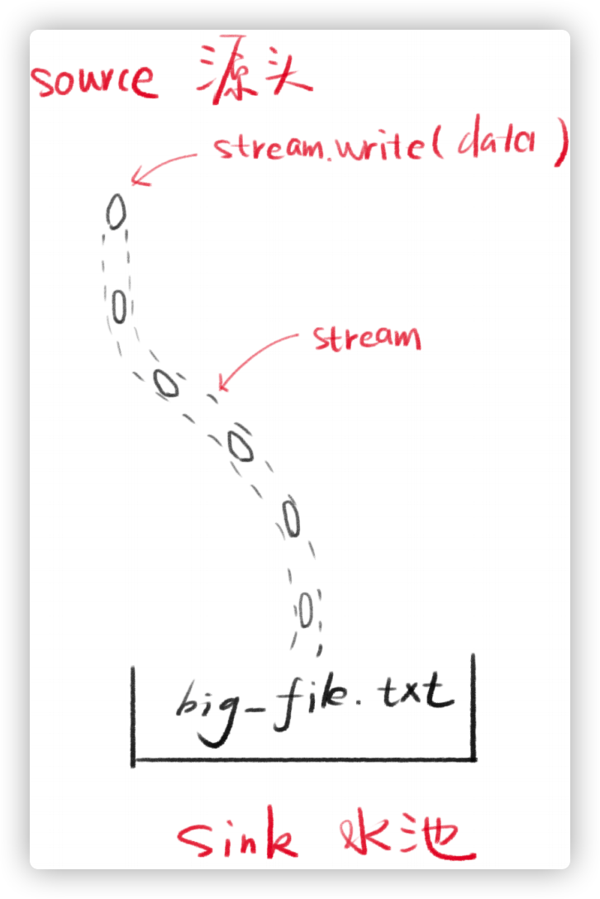
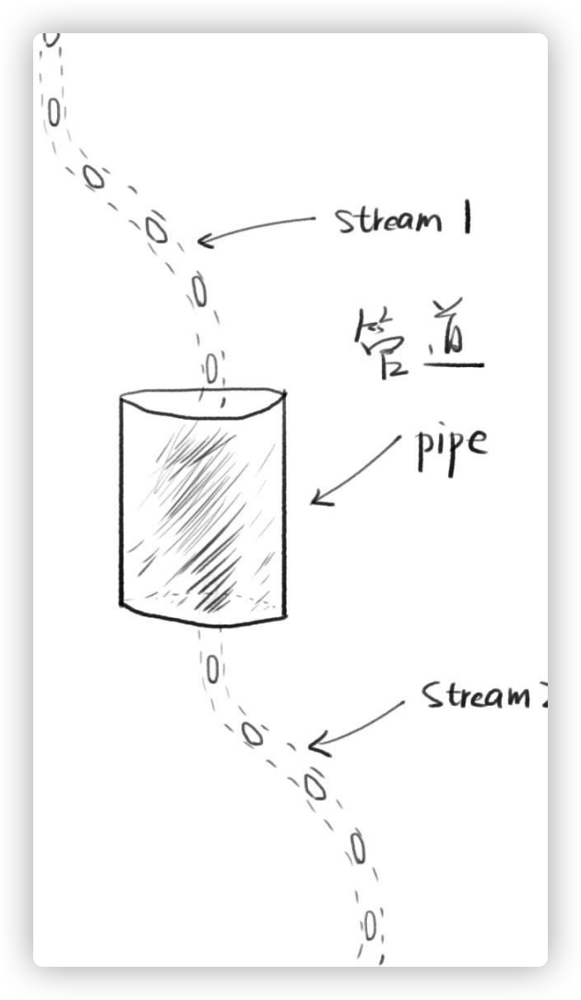
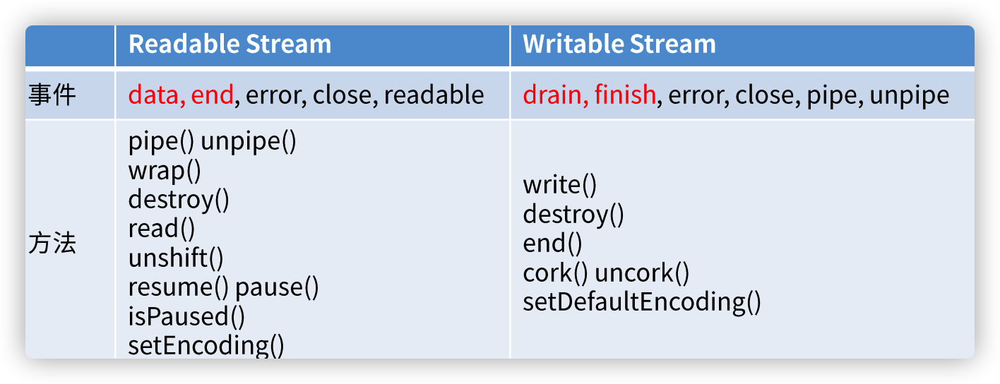
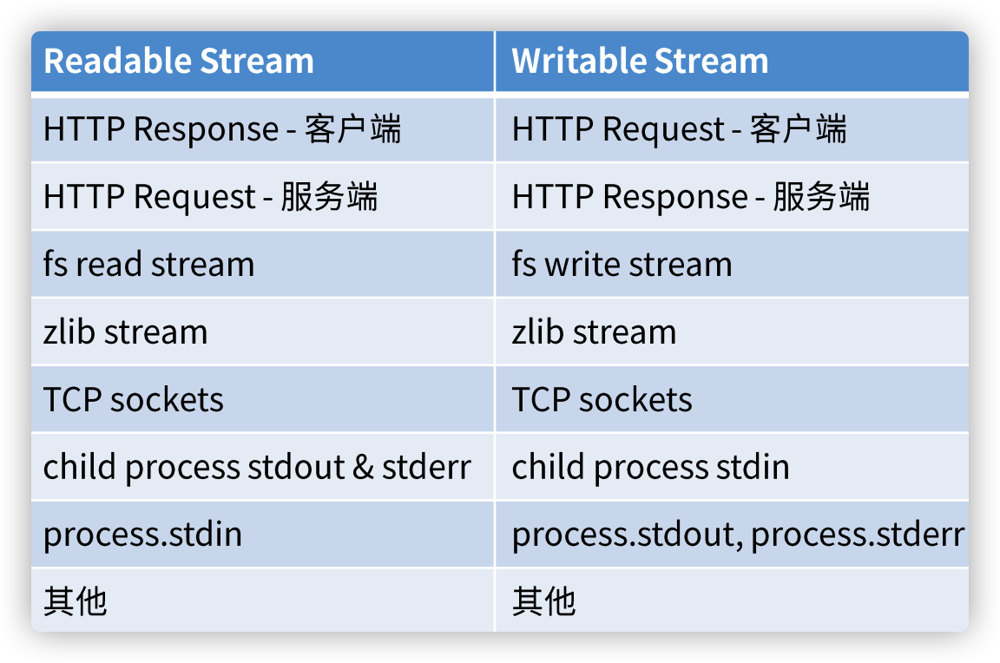

1. [Stream](#Stream)
2. [Pipe](#Pipe)
3. [原型链](#原型链)
4. [Stream分类](#Stream分类)
5. [Node.js的Stream](#Node.js的Stream)
6. [更多信息](#更多信息)

### Stream流
`Stream`是水流，数据流
* `stream.write`可以让流中有水(数据)
* 每次写的小数据叫做chunk(块)
* 产生的数据的一段叫做source(源头)
* 得到数据的一块叫做sink(水池)



代码实例1
```
const fs = require('fs')
const stream = fs.createWriteStream('./big_file.txt')
for(let i = 0; i < 1000; i++) {
  stream.write(`这是第${i}行内容`)
}
stream.end()
console.log('done')
```

步骤：
* 打开流，多次往里面塞内容，关闭流
* 多次写的过程
* 最终得到一个128兆左右的文件

代码实例2
```
const server = http.createServer()
server.on('request', (request, response)=>{
  fs.readFile('./big_file.txt', (error,data)=>{
    if(err) throw err
    response.end(data)
    console.log('done')
  })
})
server.listen(8888)
```
* Node.js内存占用，大概在130mb


代码实例3
```
const server = http.createServer()
server.on('request', (request, response)=>{
  const stream = fs.createReadStream('./big_file.txt')
  stream.pipe(response)
  })
server.listen(8888)
```
* js内存占用，大概低于30mb
* 文件`stream`和`response stream`通过管道相连

### Pipe
两个流可以用一个管道相连
* `stream1`的末尾连接上`stream2`的开端
* 一旦`stream1`有数据，就会留到`stream2`



代码
```
stream1.pipe(stream)
```
链式操作
```
a.pipe(b).pipe(c)
// is equal to 
a.pipe(b)
b.pipe(c)
```
#### 管道可以通过事件实现
```
// stream1 一有数据就塞给stream2
stream1.on('data', (chunk)=>{
  stream2.write(chunk)
})
// stream1 停了，就停掉stream2
stream1.on('end', ()=> {
  stream2.end()
})
```
### 原型链
```
s = fs.createReadStream
```
对象层级有
* 自身属性（由fs.ReadStream构造）
* 原型：stream.Readable.prototype
* 二级原型：stream.Stream.prototype
* 三级原型：event.EventEmitter.prototype
* 四级原型：Object.prototype
* Stream对象都继承了EventEmitter


支持的事件和方法


### Stream分类
共有四类
* Readable-可读
* Writable-可写
* Duplex-可读可写（双向）
* Transform-可读可写（变化）

Reable Stream
* 静止态paused和流动态flowing
* 默认处于paused态
* 添加data事件监听，变化为flowing态
* 删掉data事件监听，变化为paused态
* pause（）可以将它变化为paused
* resume() 可以将它变化为flowing

Writable Stream
drain事件
* drain流干了，表示可以添加数据了
* 调用stream.write(chunk)的时候，可能会得到false
* false的意思表示写的速度太快，积压了
* 这个时候不能再write了，要监听drain
* 等drain事件触发了，才能继续write
finish事件
* 调用stream.end()之后
* 缓冲区数据已经传给底层系统之后
* 触发finish事件

代码示例：Writable Stream
保存为writable.js文件。然后运行该文件，不管输入什么，都会得到相同的结果
```
const { Writable } = require("stream");
  const outStream = new Writable({
  write(chunk, encoding, callback) {
    console.log(chunk.toString());
    callback();
  }
});
process.stdin.pipe(outStream);
```

代码示例：Readable Stream
保存为readable.js文件。然后运行，先把所有数据push进去，然后pipe
```
const { Readable } = require("stream");
const inStream = new Readable();
inStream.push("ABCDEFGHIJKLM");
inStream.push("NOPQRSTUVWXYZ");
inStream.push(null); // No more data
inStream.pipe(process.stdout);
```
代码示例
保存文件为readable2.js，本次数据是按需供给的，对方调用read才会给一次数据
```
const { Readable } = require("stream");

const inStream = new Readable({
  read(size) {
  this.push(String.fromCharCode(this.currentCharCode++));
      if (this.currentCharCode > 90) {
        this.push(null);
      }
    }
  })
inStream.currentCharCode = 65
inStream.pipe(process.stdout)
// readable2.js n
```
代码示例： Duplex Steam
```
const { Duplex } = require("stream");
const inoutStream = new Duplex({
  write(chunk, encoding, callback) {
    console.log(chunk.toString());
    callback();
},
  read(size) {
    this.push(String.fromCharCode(this.currentCharCode++));
    if (this.currentCharCode > 90) {
      this.push(null);
    }
  }
});
inoutStream.currentCharCode = 65;
process.stdin.pipe(inoutStream).pipe(process.stdout);
```
代码示例：Transform Stream
```
const { Transform } = require("stream");
const upperCaseTr = new Transform({
  transform(chunk, encoding, callback) {
    this.push(chunk.toString().toUpperCase());
    callback();
  }
});
```
代码示例: 内置的Transform Stream
```
const fs = require("fs");
const zlib = require("zlib");
const file = process.argv[2];

fs.createReadStream(file)
  .pipe(zlib.createGzip())
  .pipe(fs.createWriteStream(file + ".gz"));
```
```
const fs = require("fs");
const zlib = require("zlib");
const file = process.argv[2];

fs.createReadStream(file)
  .pipe(zlib.createGzip())
  .on("data", () => process.stdout.write("."))
  .pipe(fs.createWriteStream(file + ".zz"))
  .on("finish", () => console.log("Done"));
```
```
const file = process.argv[2];
const { Transform } = require("stream");
const reportProgress = new Transform({
  transform(chunk, encoding, callback) {
    process.stdout.write(".");
    callback(null, chunk);
  }
});

fs.createReadStream(file)
  .pipe(zlib.createGzip())
  .pipe(reportProgress)
  .pipe(fs.createWriteStream(file + ".zz"))
  .on("finish", () => console.log("Done"));
```
```
const crypto = require("crypto");
// ..
fs.createReadStream(file)
  .pipe(zlib.createGzip())
  .pipe(crypto.createCipher("aes192", "123456"))
  .pipe(reportProgress)
  .pipe(fs.createWriteStream(file + ".zz"))
  .on("finish", () => console.log("Done"));
```

### Node.js的Stream



### 更多信息
> [Node's Streams](https://jscomplete.com/learn/node-beyond-basics/node-streams)

> [drain](https://nodejs.org/api/stream.html#stream_event_drain)

> [Stream English Version](https://nodejs.org/api/stream.html)

> [Stream Chinese Version](http://nodejs.cn/api/stream.html)

> [数据流中的积压问题](https://nodejs.org/zh-cn/docs/guides/backpressuring-in-streams/)

> [面试高级前端工程师必问之流-stream](https://juejin.cn/post/6844903635617316877)
