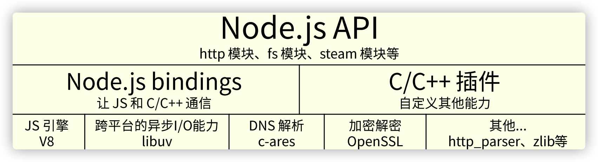
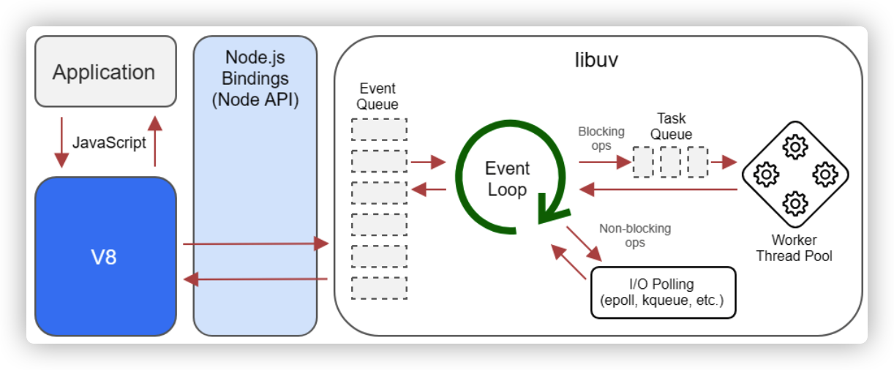

## 目录
1. [介绍Node](#介绍Node)
2. [什么是Bindings](#什么是Bindings)
3. [更多信息](#更多信息)

### 介绍Node
#### Node.js不是什么web框架
* `Node.js`不是`web`后端框架
* 不能把`Node.js`与`Flask`或`Spring`对比

#### Node.js不是编程语言
* `Node.js`不是后端的`javascript`
* 不能把`Node.js`与`Python`或`PHP`对比

#### Node.js是一个平台
* 将多种技术组合起来
* 让`JavaScript`也能调用系统接口，开发后端的应用

#### Node.js的技术
* `V8`引擎
* `libuv`
* `c/c++`实现的`c-ares`, `http-parser`, `OpenSSL`, `zilb`等库

### 什么是Bindings

`c/c++`实现了一个`http_parser`库，但是如果想直接使用这个库，需要一个中间的桥梁。`Node.js`使用`c++`对`http_parser`进行封装，使它符合某些要求，封装的文件叫做`http_parser_bindings.cpp`。使用`node.js`提供的编译工具将其编译为`.node`文件。`JS`就能直接调用`c++`库，中间的桥梁就是`bindings`。由于`node.js`提供了很多`binding`,所以称为`binginds`

### 什么是libuv
* `FreeBSD`系统上有`kqueque`
* `Linux`系统上有`epoll`
* `Windows`系统上有`IOCP`
* `Ryan`为了一个跨平台的异步`I/O`库，开始写`libuv`
* `libuv`会根据系统自动选择合适的方案
* 主要功能是用于`TCP/UDP/DNS`文件等的异步操作

### 什么是V8引擎
* 将`js`源代码变成本地代码并执行
* 维护调用栈，确保JS函数的执行顺序
* 内存管理，为所有对象分配内存
* 垃圾回收，重复利用无用的内存
* 实现JS的标准库

### 重点
* `V8`不提供`DOM API`
* `V8`执行`JS`是单线程的
* 可以开启两个线程分别执行`JS`
* `v8`本身包含多个线程，例如垃圾回收为单独线程
* `node.js` 基于`libuv`做了一个`event loop`

### 更多信息
> [Node.js v16.3.0 文档](http://nodejs.cn/api/addons.html#addons_function_arguments)
