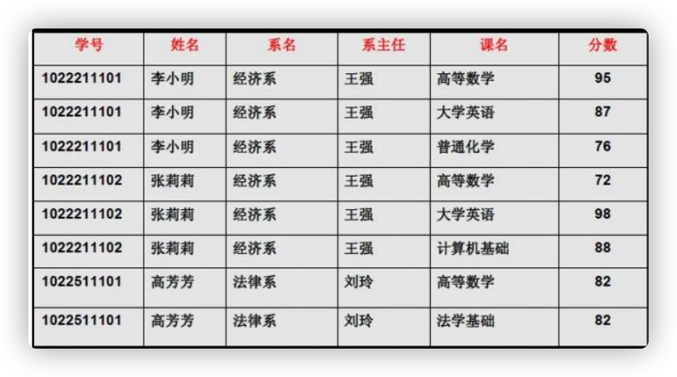

## 目录
1. [第一范式1NF](#第一范式1NF)
2. [第二范式2NF](#第二范式2NF)
3. [第三范式3NF](#第三范式3NF)
4. [数据库设计经验](#数据库设计经验)
5. [一对一](#一对一)
6. [一对多](#一对多)
7. [多对多](#多对多)
8. [什么时候建立关联表](#什么时候建立关联表)
x. [更多信息](#更多信息)

### 关系型数据库的范式
#### 第一范式1NF
* 定义: 字段不可再分
* 例如: 我们要存储体检者的双眼视力,那么应该存为左眼视力和右眼视力, 即user表应该有`left_eye`和`right_eye`两个字段，而不是存在一个字段
* 如下图是一个学生选课表，没有违反第一范式
* 缺点是数据冗长，创建系时会插入异常，删除学生会导致系小时,学生转系会造成多处改动
* 总结：第一范式不够强

#### 第二范式2NF
* 定义:
    - * 在1NF的基础上，要有键(键可由多个字段组合)
    - * 所有字段分别完全依赖于键
    - * 如果键是多个字段结合，则不允许部分依赖于该键
* 依赖关系
    - * 给出键，就能唯一确定字段的值
    - * 给出学号, 就能唯一确定姓名，反之则不行
    - * 则称姓名依赖于学号
* 改进
    - * 选课表(学号，课名, 分数)
    - * 学生表(学号, 姓名，系名,系主任)

#### 第三范式3NF
* 定义：
    - * 一个表里不能有两层依赖
    - * 给出学号，就能确定系名，系名依赖于学号
    - * 给出系号，就能确定班主任，班主任依赖于系名
    - * 系主任简介依赖于学号
    - * 解决办法：将系名和系主任单独建表

* 总结
    - * 第一范式：属性不可分割
    - * 第二范式：字段完全依赖于键
    - * 第三范式：字段没有简介依赖于键
    - * BC范式：键中的属性也不存在简介依赖

#### 数据库设计经验
##### 高内聚
* 把两个相关的字段放到一起，不相关的分开建表
* 如果两个字段能够单独建表，那就单独建表，

##### 低耦合
* 如果两个表之间有弱关系
* 一对一可放在一个表，也可以用两个表加外键
* 一对一一般用外键
* 多对多一般用中间表

### 一对一
假设一个学生只能加入一个班级

#### 可以把班级放在学生表里
* 学生id:1001, 姓名：小明，班级id: 4002
* 班级id: 4002 名称：入门1班

#### 也可以单独建立关联表
* 学生id:1001, 姓名：小明
* 学生班级id: 2003, 学长id:1001, 班级id: 4002
* 班级id: 4002, 名称：入门1班

### 一对多
假设一个作者能写多本书

#### 可以把书放在作者表里吗
* 某些DBMS支持数组，可以存两个id到一个字段
* 作者id: 100，姓名：小明，books:[2001, 2002]
* 必须支持数组形式，如果不支持数组，就不能这么做了

#### 单独建立关系表
* 作者id: 100，姓名：小明
* 出版id: 2001, 作者id: 1001, 书id：4002， 出版社id: 2222
* 出版id: 2002, 作者id: 1001, 书id：4003， 出版社id: 3333
* 书id: 4002, 名称: JS入门

### 多对多
假设一个学生可以加入多个班级，每个班级也有多个学生

#### 可以把班级放在学生表里吗
* 某些DBMS支持数组，可以存放
* 如果不支持数组，就不能这么做了

#### 单独建立关系表
* 学生id: 100，姓名：小明
* 学生id: 100, 班级id：4002， 有效期: 1
* 学生id: 101, 班级id：4002， 有效期: 1
* 班级id: 4002, 名称: JS入门1班

### 什么时候建立关联表
当关联自身存在属性时
* 比如关机的有效期，有效期为一年
* 比如关联的级别，店铺的会员分为vip1~6

### 更多信息
> [如何理解关系型数据库的常见设计范式？](https://www.zhihu.com/question/24696366/answer/29189700)
