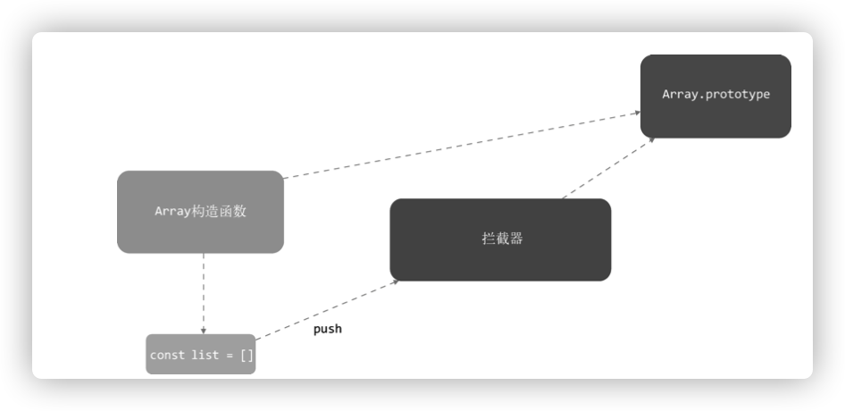
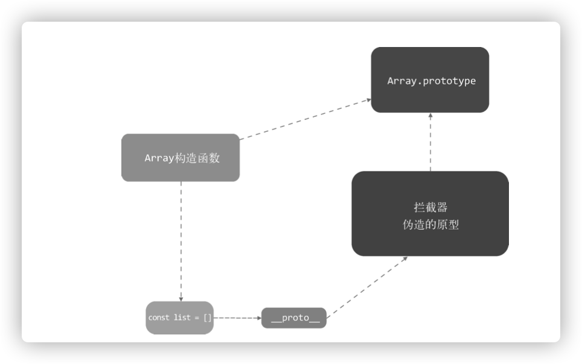
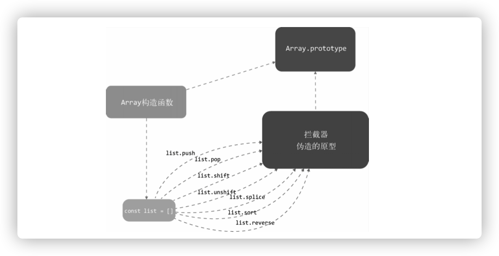

## 目录
1. [和Object的区别](#和Object的区别)
2. [如何追踪变化](#如何追踪变化)
3. [拦截器](#拦截器)
4. [使用拦截器覆盖Array原型](#使用拦截器覆盖Array原型)
5. [将拦截器方法挂载](#将拦截器方法挂载)
6. [如何收集依赖](#如何收集依赖)
7. [依赖列表存在哪儿](#依赖列表存在哪儿)
8. [收集依赖](#收集依赖)


### 和Object的区别
`Array`的检测方式和`Object`的不同, 例如
```
this.list.push(1)
```
如果说`Object`是通过`getter/setter`来实现监听，但是我们可通过`Array`的原型上的方法来修改数据内容，所以以上的实现方式就行不通了


### 如何追踪变化
数组追踪变化的原理是使用一个拦截器覆盖`Array.prototype`，之后，每当使用使用`Array`原型上的方法操作数组时，其实执行的都是拦截器中提供的方法。
然后在拦截器中使用原生`Array`的原型方法去操作数组。这样通过拦截器，我们就可以追踪到`Array`的变化




### 拦截器
拦截器其实就是和`Array.prototype`一样的`Object`, 里面包含的属性一模一样，只不过这个`Object`中某些可以改变数据自身内容的方法是处理过的。
例如`push, pop, shift, unshift, splice, sort，reverse`

```
const arrayProto = Array.prototype
export const arrayMethods = Object.create(arrayProto)
['push', 'pop', 'shift', 'unshift'， 'splice', 'sort', 'reverse'].forEach((method)=> {
    const original = arrayProto[method]
    Object.defineProperty(arrayMethods, method, {
        value: function mutator(...args) {
            return original.apply(this, args)
        },
        enumerable: false,
        writable: true,
        configurable: true
    }
})
```

上面的代码逻辑为
* 创建变量`arrayMethods`, 继承`Array.prototype`
* 接着使用`Object.defineProperty`将那些可以改变数组自身的方法进行封装
* 使用`push`方法的时候，其实调用的是`arrayMethods.push`， 即函数`mutator`
* 在`mutator`函数里面我们执行了原生事件，也可以做其他的事，例如发送变化通知


### 使用拦截器覆盖Array原型
拦截器实际上我们只希望针对那些被侦测了变化的数据生效，只覆盖那些响应式数组的原型， 而不是污染全局的Array。将一个数据转换为
响应式的，需要通过Observer, 所以只需要在`Observer`中使用拦截器覆盖那些即将转换成响应式`Array`类型数据的原型

下面的代码中，`value._proto_ = arrayMethods`覆盖了`value`原型。在`ES6`中可以使用`Object.setPrototypeOf`
实现同样的效果，但是需要考虑到兼容性的问题。
```
export class Observer {
    constructor (value) {
        this.value = value
        if (Array.isArray(value)) {
            value._proto_ = arrayMethods
        } else {
            this.walk(value)
        }
    }
}
```




### 将拦截器方法挂载
因为并不是所有浏览器都支付以上的写法，通过覆盖`_proto_`来覆盖原型。`Vue`的做法是，如果不能使用`_proto_`
就直接把`arrayMethod`身上的方法设置到被侦测的数组上。

下面的代码中使用`hasProto`判断浏览器是否支持`_proto_`, 如果支持，使用`protoArgument`函数来函数，如果不
支持，则使用`copayArgument`函数将拦截器中的方法挂载到`value`上

在有些浏览器不支持`_proto_`的情况下，会在数组上挂载一些方法，当用户使用这些方法时，其实执行的不是浏览器原生提供
的方法，而是拦截器中的方法

```
import { arrayMethods } from './array'

// 检测_proto_是否可用
const hasProto = '_proto_' in {}
const arrayKeys = Object.getOwnPropertyNames(arrayMethods)

export class Observer {
    constructor (value) {
        this.value = value
        if (Array.isArray(value)) {
            const argument = hasProto ? protoArgument : copyArgument
            argument(value, arrayMethods, arrayKeys)
        } else {
            this.walk(value)
        }
    }
    
    ...
    
    function protoArgument(target, src, keys) {
        target._proto_ = src
    }
    
    function copyArgument(target, src, keys) {
        for(let i = 0, l = keys.lenght; i < l; i++) {
            const key = keys[i]
            def(target, key, src[key])
        }
    }
}
```




### 如何收集依赖
前面我们介绍过`Object`是通知`Dep`中的依赖`Watcher`来实现依赖收集，具体是在`defineReactive`中的`getter`里使用`Dep`收集，然后
每个`key`都有一个对应的`Dep`列表来存储依赖。简单来说就是`getter`中收集依赖，依赖被存储在`Dep`中。其实数组也是在`getter`中收集依赖的。

```
this.list
```
在上面的代码中，读取`list`是从`this.list`上读取的，出触发`list`这个属性的`getter`。`Array`的依赖和`Object`也一样，也是在`defineReactive`中
收集
```
function defineReactive(data, key, val) {
    if(typeof val === 'object') new Observer(val)
    let dep = new Dep()
    Object.defineProperty(data, key, {
        enumerable: true,
        configurable: true,
        get: function () {
            dep.depend()
            // 收集依赖
            return val
        },
        set: function (newVal) {
            if(val === newVal) return
            dep.notify()
            val = newVal
        }
    })
}
```
上面注释的地方，就是收集`Array`依赖的地方，所以`Array`也是在`getter`中收集依赖，但是在拦截器中触发依赖


### 依赖列表存在哪儿
知道了如何手机依赖，下一个要面对的问题是这些依赖列表存在哪儿。`vue.js`把`Array`的依赖存放在`Observer`中
```
export class Observer {
    constructor (value) {
        this.value = value
        this.dep = new Dep() // 新增Dep

        if(Array.isArray(value)) {
            const argument = hasProto 
            ? protoArgument
            : copyArgument
            argument(value, arrayMethods, arrayKeys)
        } else {
            this.walk(value)
        }
    }
}
```
为什么数组的`Dep`依赖要保存在`Observer`实例上呢？

因为数组在`getter`中收集依赖，在拦截器中触发依赖，所以这个依赖保存位置就比较关键，必须在`getter`和拦截器中都可以访问到。要在`getter`中可以访问到`Observer`实例，同时在`Array`拦截器中可以访问到`Observer`实例


### 收集依赖
把`Dep`实例保存在`Observer`的属性上之后，我们可以在`getter`中访问并收集依赖
```
    function defineReactive (data, key, val) {
        let childOb = observe(val) // 修改
        let dep = new Dep()
        Object.defineProperty(data, key, {
            enumerable: true,
            configurable: true,
            get: function() {
                dep.depend()
                // 新增
                if(childOb) {
                    childOb.dep.depend()
                }
                return val
            },
            set: function (newVal) {
                if(val === newVal) return
                dep.notify()
                val = newVal
            }
        })
    }

    /** 
    * 尝试为value创建一个observer实例
    * 如果创建成功，直接返回新创建的observer实例
    * 如果value已经存在一个observer实例，则直接返回它
    **/
    export function observer (value, asRootData) {
        if(!isObject(value)) return
        let ob
        if (hasOwn(value, '_ob_') && value._ob_instanceof Observer) {
            ob = value._ob_
        } else {
            ob = new Observer(value)
        }
        return ob
    }
```

在上面的代码中，我们新增了函数`observe`, 它尝试创建一个`Observer`实例。如果`value`已经是响应式数据，不需要再次创建`Observer`实例，直接返回创建的`Observer`实例即可，避免了重复侦测`value`变化的问题。在`defineReactive`函数中调用了`Observe`， 它把`val`当做参数传了进入并拿到一个返回值，那就是`Observer`实例

之前介绍过数组为什么在`getter`中收集依赖，而`defineReactive`函数中的`val`很有可能会是一个数组。通过`observe`我们得到了数组的`Observer`实例(childOb), 最后通过`childOb`的`dep`执行`depend`方法来收集依赖

通过这种方式，我们就可以实现在`getter`中将依赖收集到`Observer`实例的`dep`中。即通过这样的方式可以为数组收集依赖
