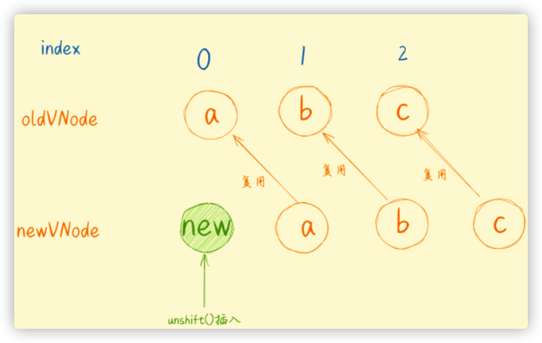

## 目录
1. [虚拟DOM](#虚拟DOM)
2. [Diff算法](#Diff算法)
3. [Diff细节](#Diff细节)
4. [vue3的Diff](#vue3的Diff)
5. [相关链接](#相关链接)

### 虚拟DOM
虚拟DOM是一个用JS来模拟真实DOM的对象
```
<ul id='list'>
    <li class='item1'>111</li>
    <li class='item2'>222</li>
    <li class='item3'>333</li>
</ul>
```
对应的虚拟DOM
```
const oldVDom = { 
     tagName: 'ul', // 标签名
     props: {  // 标签属性
        id: 'list' 
     },
     children: [ // 标签子节点
        { tagName: 'li', props: { class: 'item1' }, children: ['111'] },
        { tagName: 'li', props: { class: 'item2' }, children: ['222'] },
        { tagName: 'li', props: { class: 'item3' }, children: ['333'] },
     ]
}
```

#### 虚拟DOM的出现解决了什么问题?

在浏览器渲染机制里，每一次重排将经历多个阶段完成最终的渲染。每次事件循环之后都有UI的渲染过程，一次触发的事件循环将被放入事件循环，
如果是100次修改DOM结构，将会造成多次重排。而虚拟DOM不管修改多次，都是修改对应的虚拟DOM， 最终映射到真实DOM中，只有一次重排

#### 虚拟DOM的工作原理

* 根据初始的DOM结构，生成旧的虚拟DOM, oldDOM
* 根据数据更新后的DOM结构，生成新的虚拟DOM, newDOM
* 根据diff算法， 二者对比，找出不同，渲染出最终的真实DOM


#### 虚拟DOM的缺点

首屏加载时间更长
由于需要根据现有的真实DOM节点，生成对应的虚拟节点。会比传统的DOM更耗费一点时间

极端场景下的性能不是最佳
如果所有节点都更改了，虚拟DOM还是会进行Diff算法来比对，实际上只需要全部用新的DOM节点渲染就好了

### Diff算法

#### 同层比较
如果是不同层比较，时间复杂度增加，为O(n^3)。使用同层比较提高了时间效率


#### 对比情况
节点类型不同

例如，旧节点是p, 新节点是div,直接替换新的节点

节点类型一样，对比属性值
不触发节点的卸载和挂载，触发当前节点的更新

删除，新增 改变节点
需要找出在新节点插入的位置，这个时候`key`值很重要

文本变化
触发文本的改变

### Diff细节
vue2内部的响应式原理如下
* 数据会触发setter
* 调用Dep.notify()，通知里面的watcher, watcher里面执行回调函数
* 接着调用patch方法
* 更新响应的视图


path()函数
```
function patch(oldVnode, newVnode) { // 传入新、旧节点
  // 比较是否为一个类型的节点
  if (sameVnode(oldVnode, newVnode)) {
    // 是：继续进行深层比较
    patchVnode(oldVnode, newVnode)
  } else {
    // 否
    const oldEl = oldVnode.el // 旧虚拟节点的真实DOM节点
    const parentEle = api.parentNode(oldEl) // 获取父节点
    createEle(newVnode) // 创建新虚拟节点对应的真实DOM节点
    if (parentEle !== null) {
      api.insertBefore(parentEle, newVnode.el, api.nextSibling(oldEl)) // 将新元素添加进父元素
      api.removeChild(parentEle, oldVnode.el)  // 移除以前的旧元素节点
      // 设置null，释放内存
      oldVnode = null
    }
  }
  return newVnode
}
```

sameVNode()函数: 用来判断两个节点是否完全相同
```
function sameVnode(oldVnode, newVnode) {
  return (
    oldVnode.key === newVnode.key && // key值是否一样
    oldVnode.tagName === newVnode.tagName && // 标签名是否一样
    oldVnode.isComment === newVnode.isComment && // 是否都为注释节点
    isDef(oldVnode.data) === isDef(newVnode.data) && // 是否都定义了data
    sameInputType(oldVnode, newVnode) // 当标签为input时，type必须是否相同
  )
}
```
patchVNode ()函数：根据规则，更新newVnode
* 拿到真实的dom节点el（即oldVnode）
* 判断当前newVnode和oldVnode是否指向同一个对象，如果是则直接return
* 如果是文本节点，且文本有变化，则直接调用api 将文本替换；若文本没有变化，则继续对比新旧节点的子节点children
* 如果oldVnode有子节点而newVnode没有，则删除el的子节点
* 如果oldVnode没有子节点而newVnode有，则将newVnode的子节点真实化之后添加到el
* 如果两者都有子节点，则执行updateChildren函数比较子节点，这一步很重要---diff的核心

```
function patchVnode(oldVnode, newVnode) {
  const el = newVnode.el = oldVnode.el // 获取真实DOM对象
  // 获取新旧虚拟节点的子节点数组
  const oldCh = oldVnode.children, newCh = newVnode.children
  // 如果新旧虚拟节点是同一个对象，则终止
  if (oldVnode === newVnode) return
  // 如果新旧虚拟节点是文本节点，且文本不一样
  if (oldVnode.text !== null && newVnode.text !== null && oldVnode.text !== newVnode.text) {
    // 则直接将真实DOM中文本更新为新虚拟节点的文本
    api.setTextContent(el, newVnode.text)
  } else {
    if (oldCh && newCh && oldCh !== newCh) {
      // 新旧虚拟节点都有子节点，且子节点不一样
      // 对比子节点，并更新
      /*  diff核心！！*/  
      updateChildren(el, oldCh, newCh) 
    } else if (newCh) {
      // 新虚拟节点有子节点，旧虚拟节点没有
      // 创建新虚拟节点的子节点，并更新到真实DOM上去
      createEle(newVnode)
    } else if (oldCh) {
      // 旧虚拟节点有子节点，新虚拟节点没有
      // 直接删除真实DOM里对应的子节点
      api.removeChild(el)
    }
  }
}
```
updateChildren ()函数，算法核心。当发现新旧虚拟节点的的子节点都存在时候，需要通过一些方法来判断哪些节点是需要移动的，哪些节点是可以直接复用的，来提高我们整个diff算法的效率

如图，经过四次找到了可替换的节点


1、oldS和 newS使用sameVnode方法进行比较，sameVnode(oldS, newS) ；如果相同，则 oldS++，newS++

2、oldE 和newE使用sameVnode方法进行比较，sameVnode(oldE, newE)；如果相同，则 oldE--，newS --

3、oldS和 newE使用sameVnode方法进行比较，sameVnode(oldS, newE)；如果相同，则 oldS ++，newS --

4、oldE 和 newS使用sameVnode方法进行比较，sameVnode(oldE, newS)；如果相同，则 oldE --，newS ++

这是一个不断向内部收缩的过程，直到对比完所有的节点；
```
function vue2Diff(prevChildren, nextChildren, parent) {
  // 在新旧首尾，分别定义四个指针
  let oldStartIndex = 0,
    oldEndIndex = prevChildren.length - 1
    newStartIndex = 0,
    newEndIndex = nextChildren.length - 1;
  let oldStartNode = prevChildren[oldStartIndex],
    oldEndNode = prevChildren[oldEndIndex],
    newStartNode = nextChildren[newStartIndex],
    newEndNode = nextChildren[newEndIndex];
   // 不断向内收缩
  while (oldStartIndex <= oldEndIndex && newStartIndex <= newEndIndex) {
      if (oldStartNode.key === newStartNode.key) {
        ...
      } else if (oldEndNode.key === newEndNode.key) {
        ...
      } else if (oldStartNode.key === newEndNode.key) {
        ...
      } else if (oldEndNode.key === newStartNode.key) {
        ...
      }
  }
}
```

在经历了上面的循环后，我们可以找出一些节点并将其复用，但是我们复用的过程中，需要怎么插入这些节点呢？
以上图中的为第一步，我们可以发现，d 节点原本在旧列表末尾的节点，却是新列表中的开头节点，没有人比它更靠前，因为他是第一个，
所以我们只需要把当前的节点移动到原本旧列表中的第一个节点之前，让它成为第一个节点即可。

第二步

第二步我们可以发现了key相同的 c 节点，旧列表的尾节点oldE和新列表的尾节点newE为复用节点。原本在旧列表中就是尾节点，在新列表中也是尾节点，说明该节点不需要移动，所以我们什么都不需要做。

第三步

在第三步中我们可以看到 a 节点是可以复用的，旧列表的头节点oldS和新列表的尾节点newE为复用节点，我们只要将DOM-a移动到DOM-b后面就可以了。原本旧列表中是头节点，然后在新列表中是尾节点。那么只要在旧列表中把当前的节点移动到原本尾节点的后面，就可以了。

第四步


#### 非理想状态下
如果这四种方式都没有找到该怎么处理呢？


可以看到图中四次比较都没有找到可以复用的节点，那么我们只能把所有旧子节点的 key 做一个映射到旧节点下标的 key -> index 表，然后用新 vnode 的 key 去找出在旧节点中可以复用的位置；可以看下图的处理。拿新列表的第一个节点去旧列表中找与其key相同的节点。

那么我们就以 newCh 的首节点的key值，去到 oldCh 的 key - index 的映射表中，去根据key值找到对应的节点，同时将 b 节点移动到首部去，因为在新列表中 b 就属于首部，所以在oldCh中也需要移动到首部 ；同时，还需要将 oldCh 中的 b 节点设为 undefined , 
因为已经复用过了，就可以跳过比较了。

这个非理想的状态下的对比时间复杂度为 O(n^2):
```
function vue2Diff(prevChildren, nextChildren, parent) {
  //...
  while (oldStartIndex <= oldEndIndex && newStartIndex <= newEndIndex) {
    if (oldStartNode.key === newStartNode.key) {
    //...
    } else if (oldEndNode.key === newEndNode.key) {
    //...
    } else if (oldStartNode.key === newEndNode.key) {
    //...
    } else if (oldEndNode.key === newStartNode.key) {
    //...
    } else {
      // 在旧列表中找到 和新列表头节点key 相同的节点
      let newtKey = newStartNode.key,
        oldIndex = prevChildren.findIndex(child => child.key === newKey);
      
      if (oldIndex > -1) {
        let oldNode = prevChildren[oldIndex];
        patch(oldNode, newStartNode, parent)
        parent.insertBefore(oldNode.el, oldStartNode.el)
        // 复用后，设置为 undefined 
        prevChildren[oldIndex] = undefined
      }
      newStartNode = nextChildren[++newStartIndex]
    }
  }
}
```


### vue3的Diff
那么相比vue2中的双端对比，在vue3中的diff算法，又做了哪些优化呢？

以下面的例子来看：


1. 从头对比找到有相同的节点 patch ，发现不同，立即跳出。

2. 如果第一步没有patch完，立即，从后往前开始patch ,如果发现不同立即跳出循环。

3. 如果新的节点大于老的节点数 ，对于剩下的节点全部以新的vnode处理（这种情况说明已经patch完相同的vnode）。

4. 对于老的节点大于新的节点的情况 ， 对于超出的节点全部卸载（这种情况说明已经patch完相同的vnode）。

5. 不确定的元素（这种情况说明没有patch完相同的vnode） 与 3 ，4对立关系。

前面的逻辑跟vue2还是比较像，逐渐向中间收缩，那么关键点就在判断哪些节点是需要变动的。

在经历上述操作后，会出现以下节点需要判断（即图中圈起来的节点）：


首先，我们以新节点的数量创建一个 source 数组，并用 -1 填满；
这个source数组就是用来做新旧节点的对应关系的，我们将新节点在旧列表的位置存储在该数组中，我们再根据source计算出它的最长递增子序列用于移动DOM节点。

其次，我们先建立一个对象存储当前新列表中的节点与index的关系：
```
const newVNodeMap = {
    c: '1',
    d: '2',
    b: '3',
    i: '4'
}
```

然后再去旧列表中去找相同的节点，并记录其index的位置。
在找节点时，如果旧节点在新列表中没有的话，直接删除就好。除此之外，我们还需要一个数量表示记录我们已经patch过的节点，如果数量已经与新列表剩余的节点数量一样，那么剩下的旧节点我们就直接删除了就可以了。


Dom如何移动？
首先，我们需要定义一个Lis数组来存储source中的最长连续递增子序列的下标：-   然后从后往前遍历 source 数组；这个过程中会发生三种情况：

当前数值为 -1 ，也就说明该节点是新增的，我们直接将其插入到队尾就好了，同时 i--。
当前的索引和 Lis 中的值一致，即 i == Lis[j] ，同时 i --, j --。
当前的索引不是 Lis 中的值，那么该节点就需要进行移动，我们只需要将该节点插入到队尾就可以了，因为队尾是排好序的。

tips：没看懂这三种情况？不要慌：

我们来一步一步拆解：

首先，i = 3，即上图中，值为 -1 为第一种情况，节点需要新增，i--；

i = 2，索引为 2 != Lis[j] ****为第三种情况，节点需要移动，直接在旧列表中，将b节点插入到尾部位置，i --


i = 1，此时索引 i == Lis[j] 为第二种情况，我们的节点不需要移动；

i = 0，此时索引 i == Lis[j] 为第二种情况，我们的节点也不需要移动；
至此 vue3的diff的对比过程就已经完成了，相比于2中的首尾指针法，在这种非理想情况下的节点对比采用了最长递增子序列的算法思想来做处理；

这三种情况对应在源码中 ：

```
function vue3Diff(prevChildren, nextChildren, parent) {
  //...
  if (move) {
    // 需要移动
    const seq = lis(source); // [0, 1]
    let j = seq.length - 1;  // 最长子序列的指针
    // 从后向前遍历
    for (let i = nextLeft - 1；i >= 0; i--) {
      let pos = nextStart + i, // 对应新列表的index
        nextNode = nextChildren[pos], // 找到vnode
        nextPos = pos + 1，    // 下一个节点的位置，用于移动DOM
        refNode = nextPos >= nextChildren.length ? null : nextChildren[nextPos].el, //DOM节点
        cur = source[i];      // 当前source的值，用来判断节点是否需要移动
      if (cur === -1) {
        // 情况1，该节点是全新节点
        mount(nextNode, parent, refNode)
      } else if (cur === seq[j]) {
        // 情况2，是递增子序列，该节点不需要移动
        // 让j指向下一个
        j--
      } else {
        // 情况3，不是递增子序列，该节点需要移动
        parent.insetBefore(nextNode.el, refNode)
      }
    }
  } else {
  // 不需要移动
  for (let i = nextLeft - 1；i >= 0; i--) {
      let cur = source[i];              // 当前source的值，用来判断节点是否需要移动
    
      if (cur === -1) {
       let pos = nextStart + i,         // 对应新列表的index
          nextNode = nextChildren[pos], // 找到vnode
          nextPos = pos + 1，           // 下一个节点的位置，用于移动DOM
          refNode = nextPos >= nextChildren.length ? null : nextChildren[nextPos].el, //DOM节点
          mount(nextNode, parent, refNode)
      }
    }
}
```
你可能会问，你这边递增的子序列需要连续吗，那么这里给你将例子稍微变动一下：这时候你会发现连续递增的节点是 c, d, e 他们不是紧密连续的，但是在整个list中却是保持index递增的，也不需要移动。

思考题
参考上面的图解，结合源码，看看下面例子中的虚拟dom节点是怎么移动的。


时间复杂度的优化
这里我们只需要找出source中的最长连续递增子序列 就ok了：

最长连续递增子序列
直接放一道leetcode吧：最长递增子序列[2]
举个例子：[10,5,6,7,4,1,2,8,9]

那么在该此例子中，连续递增的子序列是 [5,6,7,8,9], 所以返回的个数是5；

可以参考该算法的基础实现：

```
const arr = [10,5,6,7,4,1,2,8,9]
function lis(arr) {
  let len = arr.length,
    dp = new Array(len).fill(1); // 用于保存长度
  // i = 0 => O(n^2) ;  i != 0 =>  O(nlogn)
  for (let i = len - 1; i >= 0; i--) { 
    let cur = arr[i]
    for(let j = i + 1; j < len; j++) {
      let next = arr[j]
      // 如果是递增 取更大的长度值
      if (cur < next) dp[i] = Math.max(dp[j]+1, dp[i])
    }
  }
  return Math.max(...dp)
}
lis(arr) // 5
```

在vue3中依赖于最长递增子序列去做节点的移动和删除/新增，时间复杂度为O(nlgn)～O(n^2)

至此vue3.0的diff算法大致理念以及概括完了，如果想要深入了解可以去阅读以下源码部分
vue3 diff 源码[3]
四、key值的作用，为什么不能使用index作为key值？
key的作用--性能更高
在Vue中判断节点是否可复用都是以key值作为判断的前提条件，如果不使用key值判断，会默认更新所有节点，而Vue中组件的更新过程也是极其复杂的，所以会造成一些不必要性能的成本；所以key可以更高效的帮助我们判断节点的可复用性。
为什么不能使用index作为key？
很简单，来看个例子：
```
<ul>                      <ul>
    <li key= 0 >a</li>        <li key= 0 >new</li>  // 新增
    <li key= 1 >b</li>        <li key= 1 >a</li>
    <li key= 2 >c</li>        <li key= 2 >b</li>
                              <li key= 3 >c</li></ul>                                               
</ul>
```

按理来说，我们应该会复用里面的 a、b、c 三个节点对吧；



看这个例子，我们直接unshift() 插入列表一个新元素，这时候index发生了变化！！即key也会发生变化！！
但是我们知道：按照Vue中的比较思路，这样的话，我们就无法复用哪些本来可以复用的节点，导致该节点被重新渲染一次，造成vue组件内一些列的更新，如果列表一旦很大，开销成本巨大！


只要此时你的列表是一个动态的列表：而且使用了index作为key值，当你新增或者删除列表时候，key的排序总是以0、1、2、3...去排序的，而这样也会导致列表元素的key值在不断变化；导致 Vue 不能准确的找到可复用的节点，而是去直接做了patch操作，造成很多额外的工作。
解决办法--唯一值
这也是我们为什么要用一个唯一的值去作为列表的key值的原因了！所以我们一般可以用id/唯一值作为key，这是规范问题，所以大家以后再看到项目中有index作为key的情况，请让他去学习diff算法吧哈哈哈！
所以在学习了diff之后要警示我们：
1、key值要选择一个唯一值，通常用id来做key
2、不要做一些无谓的dom结构修改或者跨层级去操作一些dom

### 相关链接
> [原始链接](https://mp.weixin.qq.com/s/a54pTwwl5-ujrX57jRznDQ)
> [相关链接](https://juejin.cn/post/6994959998283907102)
